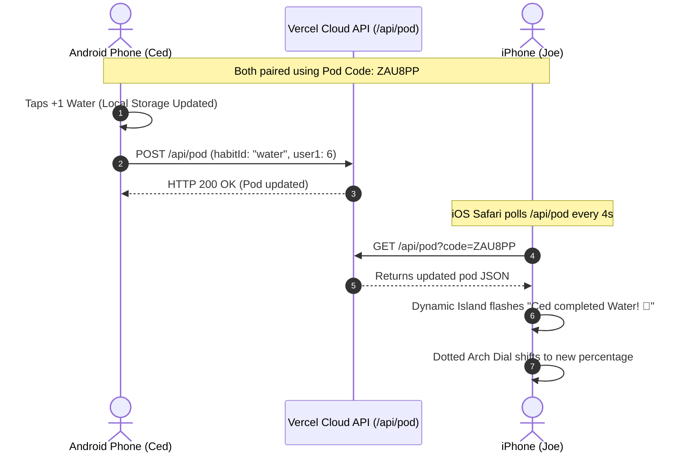

<div align="center">

# 🔥 DuoTrack
### Shared Co-Op Habit Tracking for Best Friends & Couples

[](https://react.dev/)
[](https://vitejs.dev/)
[](https://capacitorjs.com/)
[](https://vercel.com/)
[](LICENSE)

*Inspired by Cedlom's viral journey (**"I Built an App with 0 Experience"**), re-engineered with dual-engine UI for **Android 16 Material 3 Expressive** and **iOS 18+ Liquid Glass**.*

[📥 Download Android APK (v1.0)](./DuoTrack.apk) • [🚀 Deploy to Vercel](#-deploy-to-vercel-in-60-seconds) • [✨ Features](#-key-features) • [🍎 iOS Setup](#-ios-installation-no-sideloading)

---

</div>

## 📖 The Story

Building habits alone is tough; building them with a partner keeps you accountable. **DuoTrack** connects two people in a shared **"Pod"**. Every glass of water you drink, page you read, or vitamin you take pushes the shared **Pod Health Dial** forward on both devices in real time.

---

## ✨ Key Features

### 🎯 1. Signature Dotted Arch Progress Dial
- **22-Segment Curved Arc**: Dual-colored progress dots (Mint Teal for You, Coral Pink for Partner).
- **Hero Center Percentage**: Real-time combined pod goal completion with yesterday's comparison badge (`87% YESTERDAY ↗`).
- **Progress Summary**: Live count of goals currently in sync (`4 of 7 goals in sync today`).

### 🤝 2. Rich Co-Op Habit Cards
- **💤 Sleep Cycles**: Segmented horizontal rounded sleep bars comparing hours & minutes (e.g. `6h` vs `7h 10m`).
- **👟 Steps**: Dual concentric circular rings with quick `+500` and `+1.5k` steppers.
- **🧘 Meditation**: Concentric mindfulness breathing pulse animation with quick minutes logger.
- **💧 Hydration**: Interactive liquid pint counter with tactile drink action.
- **📖 Reading**: Visual bookmark progress meter for pages per day or books per month.
- **🏋️ Workouts**: Active exercise minutes hero with partner indicator.
- **💊 Vitamins**: AM/PM split toggle pill with celebratory micro-animations.
- **🌱 Beyond Today**: Periodic shared goals for Savings (`$`) and Weight (`lbs`).

### 🏝️ 3. Dual-OS Design Engine & Dynamic Island
- **Android 16 Material 3 Expressive**: Surface containers, tonal elevation, pill chips, and an expressive Floating Action Button (FAB).
- **iOS 18+ Liquid Glass**: Frosted glassmorphism (`backdrop-filter: blur(28px)`), specular inner borders, and Cupertino frosted bottom tab navigation.
- **Interactive Dynamic Island**: Live activity pill that dynamically expands when you or your partner check off a habit.

### 📱 4. Symmetrical 5-Widget Suite (Both OSs)
1. **Small (2×2) Pod Sync Ring**: Frosted glass squircle / M3 surface dial.
2. **Medium (4×2) Shared Pod Progress**: Side-by-side user progress with inline action chips.
3. **Bento (4×2) Dashboard Card**: Pod score, step rings, vitamin check, and instant partner ping.
4. **Scalloped (2×2) Organic Dial**: Tactile circular gauge with quick logger button.
5. **Lock Screen Minimal Capsule**: At-a-glance lock screen status widget.

### 🛡️ 5. Zero Telemetry & Privacy-First Architecture
- **100% Local-First Storage**: Operates fully offline without internet.
- **Zero OS Permissions Required**: Camera, microphone, location, and contacts are strictly disabled.
- **Encrypted Local Export**: 1-click JSON backup and complete local data wipe.

---

## ☁️ Cross-Device Real-Time Sync Architecture

DuoTrack uses **Vercel Serverless Functions** (`/api/pod`) to bridge Android native APK users and iOS iPhone users with zero dedicated server maintenance:



---

## 🚀 Deploy to Vercel in 60 Seconds

You can host both the **iOS Web App** and the **Serverless Sync Backend** simultaneously for free:

### Option 1: 1-Click via Vercel CLI
```bash
npx vercel
```
Press **Enter** to accept the defaults. Vercel will output your production link (e.g. `https://duotrack.vercel.app`).

### Option 2: Import on Vercel Dashboard
1. Fork or push this repository to your GitHub account.
2. Go to [vercel.com](https://vercel.com) &rarr; **Add New Project** &rarr; **Import** your repo.
3. Click **Deploy**.

---

## 📲 Installation Guide

### 🤖 Android (Native APK)
1. Download [`DuoTrack.apk`](./DuoTrack.apk) directly from this repository.
2. Open and install it on your phone.
3. In **Settings** &rarr; **Cloud Sync**, paste your Vercel URL and tap **Test & Save**.
4. You're connected!

### 🍎 iOS Installation (No Sideloading Required!)
Apple blocks installing raw `.ipa` or `.apk` files without paid developer accounts or 7-day expirations. DuoTrack runs as a first-class **Progressive Web App (PWA)**:
1. Open your deployed Vercel link in **Safari** on iPhone.
2. Tap the **Share** button (the square with an upward arrow) at the bottom.
3. Tap **"Add to Home Screen"** &rarr; **Add**.
4. Launch DuoTrack from your home screen: it opens full-screen with native safe-area insets, haptic audio, and zero browser bars!

---

## 💻 Local Development

```bash
# Clone the repository
git clone https://github.com/palakharinkhede4/DuoTrack.git
cd DuoTrack

# Install dependencies
npm install

# Start Vite dev server
npm run dev

# Build for production
npm run build

# Sync & build Android APK
npx cap sync android
cd android && ./gradlew assembleDebug
```

---

## 🛠️ Tech Stack
- **Frontend**: React 19, Vite, Vanilla CSS Design Tokens (Zero Tailwind).
- **Mobile Bridge**: Capacitor 7 (Android WebView with hardware-accelerated CSS).
- **Backend / Sync**: Vercel Serverless Node Function (`api/pod.js`) with Upstash / KV persistence support.
- **Audio Engine**: Web Audio API Synthesizer with automatic memory suspension.

---

## 📄 License
MIT © [Palak Harinkhede](https://github.com/palakharinkhede4)
